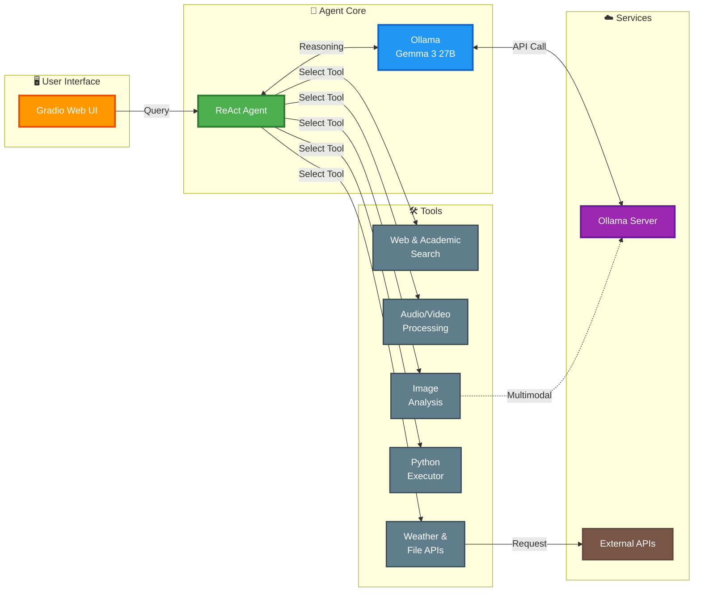

# 🤖 Versatile Multi-Tool LangChain Agent

[](https://www.python.org/downloads/)
[](https://www.langchain.com/)
[](https://ollama.ai/)
[](https://gradio.app/)

## 🚀 Technology Stack

| Category | Technologies |
|----------|-------------|
| **AI Framework** | LangChain 1.1.0, LangGraph, LangSmith |
| **LLM Backend** | Ollama (Gemma 3 27B), ChatOllama |
| **Agent Pattern** | ReAct (Reasoning + Acting) |
| **Web Interface** | Gradio 6.0.1, FastAPI |
| **Multi-Modal** | OpenAI Whisper, Pillow, OpenCV |
| **Search Tools** | DuckDuckGo, ArXiv, Wikipedia |
| **Media Processing** | yt-dlp, FFmpeg, PyDub |
| **Data Processing** | Pandas, NumPy, PyTorch 2.9.1 |
| **Authentication** | Hugging Face OAuth, Google Auth |

---

## 📐 System Architecture



---

## 🌟 Project Description

This repository showcases a **production-ready multi-tool AI agent** built on the LangChain framework, designed to run entirely on **self-hosted infrastructure** using Ollama. The agent leverages the **Gemma 3 27B** model and implements the **ReAct (Reasoning and Acting)** pattern for intelligent tool selection and execution.

### Core Capabilities

- ✅ **Multimodal Understanding**: Analyzes images using vision-language capabilities
- ✅ **Media Processing**: Transcribes audio and video content with Whisper
- ✅ **Information Retrieval**: Searches web, academic papers, and encyclopedic knowledge
- ✅ **Code Execution**: Runs Python code dynamically for complex calculations
- ✅ **API Integration**: Fetches real-time weather and external data
- ✅ **Reliable Parsing**: Handles complex multi-argument tool calls with custom input parsing

---

## 🛠️ Tool Ecosystem

### 1. Multimodal & Vision Tools

#### `caption_image_func`
Analyzes local image files using Ollama's multimodal API.

**Example Input:**
```python
"image_path='/path/to/chess.png', prompt='What is the best next move for black?'"
```

### 2. Media Processing Tools

#### `youtube_transcript_func`
Downloads and transcribes YouTube videos using yt-dlp and Whisper.

**Example Usage:**
```python
"Extract transcript from https://www.youtube.com/watch?v=VIDEO_ID"
```

#### `transcribe_audio_whisper`
Transcribes local audio files (MP3, WAV) using OpenAI Whisper.

### 3. Information Retrieval Tools

#### `general_web_search` (DuckDuckGo)
Real-time web search for current news and general information.

#### `academic_search` (ArXiv)
Searches academic papers and scientific research.

#### `wikipedia_search`
Queries Wikipedia for encyclopedic knowledge.

### 4. File & Data Tools

#### `file_download_func`
Downloads files by task ID and provides content previews for Excel, JSON, images, and audio.

**Supported Formats:**
- Excel (.xlsx) → DataFrame preview
- JSON → Parsed content
- Images (.png, .jpg) → File path for vision analysis
- Audio (.mp3) → File path for transcription

### 5. Computation Tools

#### `python_repl_tool`
Executes arbitrary Python code for mathematical calculations and data processing.

**Example:**
```python
"Run this Python code: print(sum([i**2 for i in range(1, 101)]))"
```

### 6. API Integration Tools

#### `WeatherInfoTool`
Fetches current weather data from WeatherStack API.

**Example:**
```python
"What's the current weather in Tokyo?"
```

---

## ⚙️ Setup and Installation

### Prerequisites

**1. Python Environment**
- Python 3.11 or newer
- pip package manager

**2. Ollama Server**
- Install Ollama from [ollama.ai](https://ollama.ai)
- Pull the Gemma 3 model:
  ```bash
  ollama pull gemma3:27b
  ```
- Run Ollama server:
  ```bash
  ollama serve
  ```
- *Optional*: Expose via Cloudflare Tunnel for remote access

**3. System Dependencies**
```bash
# Ubuntu/Debian
sudo apt install yt-dlp ffmpeg

# macOS
brew install yt-dlp ffmpeg

# Windows (using Chocolatey)
choco install yt-dlp ffmpeg
```

### Installation Steps

**1. Clone the Repository**
```bash
git clone https://github.com/yourusername/langchain-agent.git
cd langchain-agent
```

**2. Install Python Dependencies**
```bash
pip install -r requirements.txt
```

**3. Configure Environment Variables**

Create a `.env` file in the project root:
```env
CLOUDFLARE_TUNNEL_URL=https://your-ollama-tunnel-url.com
WEATHER_API=your_weatherstack_api_key
OLLAMA_MODEL_ID=gemma3:27b
```

**4. Set Up API Keys**
- **WeatherStack**: Get a free API key from [weatherstack.com](https://weatherstack.com)
- **Hugging Face** (optional): For Gradio OAuth features

---

## 🎯 Usage

### 1. Run the Gradio Web Interface

```bash
python app.py
```

Access the web UI at `http://localhost:7860`

**Features:**
- Login with Hugging Face account
- Run evaluation on multiple questions
- Submit answers and get scored results
- View detailed agent logs

### 2. Use the Agent Programmatically

```python
from agent import build_agent

# Initialize the agent
agent = build_agent()

# Ask a question
response = agent.invoke({
    "input": "What's the weather in New York?",
    "chat_history": []
})

print(response['output'])
```

### 3. Test Individual Tools

```bash
python agent_tester.py
```

This runs a comprehensive test suite covering all tools with performance metrics.

---

## 📊 Project Structure

```
langchain_agent/
├── agent.py              # Core agent logic and tool definitions
├── app.py                # Gradio web interface
├── agent_tester.py       # Tool testing framework
├── requirements.txt      # Python dependencies
├── system_prompt.txt     # ReAct agent system prompt
├── README.md            # This file
└── .env                 # Environment variables (create this)
```

---

## 🔧 Configuration

### Agent Behavior

Edit `system_prompt.txt` to customize the agent's behavior, output format, and reasoning style.

### Tool Selection

Modify the `tools` list in `agent.py` (line 383-392) to add/remove tools:

```python
tools = [
    WeatherInfoTool,
    transcribe_audio_whisper,
    youtube_transcript_func,
    caption_image_func,
    file_download_func,
    search_tool,
    wiki_search_tool,
    archive_search_tool,
    python_repl_tool,
]
```

### Ollama Configuration

Update these constants in `agent.py` (lines 27-29):

```python
CLOUDFLARE_TUNNEL_URL = "http://localhost:11434"  # or your tunnel URL
OLLAMA_MODEL_ID = "gemma3:27b"  # or another model
WEATHER_API = "your_api_key_here"
```

---

## 🎨 Key Technical Features

### 1. Robust Input Parsing
The agent uses custom regex-based parsing to handle complex multi-argument tool calls:

```python
# Example: Handles inputs like
# "image_path='/path/file.png', prompt='Analyze this'"
matches = re.findall(r"(\w+)\s*=\s*([^\,]+)", raw_input)
```

### 2. ReAct Agent Pattern
Implements the powerful ReAct (Reasoning + Acting) pattern:
- **Thought**: Agent reasons about the task
- **Action**: Selects and executes appropriate tool
- **Observation**: Processes tool output
- **Repeat**: Continues until final answer is reached

### 3. Error Handling
Built-in error recovery with `handle_parsing_errors=True` allows the agent to self-correct when tool calls fail.

### 4. Performance Tracking
Integrated timing metrics for monitoring tool execution speeds:

```python
weather_time = weather_stop - weather_start
print(f"⏱️ Weather tool response: {weather_time:.2f} seconds")
```

---

## 🧪 Testing

Run the comprehensive test suite:

```bash
python agent_tester.py
```

**Test Coverage:**
- Image analysis
- Web search
- Academic search
- Wikipedia queries
- Weather API
- Python code execution
- YouTube transcription
- File downloads

---

## 📝 Example Workflows

### Workflow 1: Image Analysis
```
User: "Analyze the image at /path/chess.png and suggest the best move for black"
→ Agent selects caption_image_func
→ Sends image to Ollama multimodal API
→ Returns chess move analysis
```

### Workflow 2: Research + Calculation
```
User: "Find the latest paper on quantum computing and calculate 2^1024"
→ Agent selects academic_search (ArXiv)
→ Agent selects python_repl_tool
→ Combines research results with calculation
```

### Workflow 3: Media Transcription
```
User: "Transcribe https://youtube.com/watch?v=XYZ and summarize"
→ Agent uses youtube_transcript_func
→ Downloads audio with yt-dlp
→ Transcribes with Whisper
→ Summarizes content using LLM
```

---

## 🔒 Security Notes

- API keys are stored in environment variables, not hardcoded
- Create a `.gitignore` to exclude `.env` files
- Use secure tunnels (Cloudflare) for remote Ollama access
- Validate user inputs before executing Python code

---

## 🤝 Contributing

Contributions are welcome! Please:

1. Fork the repository
2. Create a feature branch
3. Add tests for new tools
4. Submit a pull request

---

## 📜 License

This project is licensed under the MIT License.

---

## 🙏 Acknowledgments

- **LangChain** for the agent framework
- **Ollama** for local LLM hosting
- **OpenAI Whisper** for audio transcription
- **Gradio** for the web interface
- **Hugging Face** for model hosting and evaluation infrastructure
